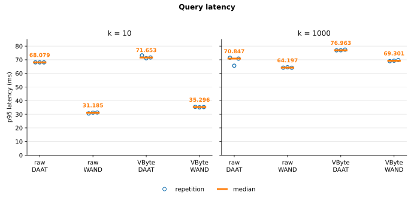
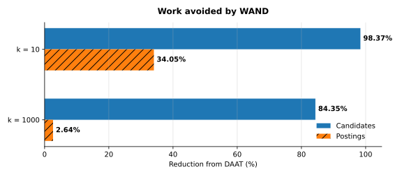

# Benchmarks

These benchmarks compare raw and VByte postings using DAAT and WAND on MS
MARCO Passage v1.

## Results

| Metric | Raw | VByte |
| --- | ---: | ---: |
| Index size | 2,004.311 MiB | 760.948 MiB |
| Bytes per posting | 9.019 | 3.424 |
| Median build time | 355.175 s | 360.210 s |
| Median workload time reduction with WAND, k = 10 | 56.48% | 52.38% |
| Median workload time reduction with WAND, k = 1000 | 7.98% | 8.24% |

VByte made the index 62.03% smaller. It took 1.42% longer to build and 5.40% to
15.33% longer to query.

[Per-run results (JSON)](results.json)

## Setup

- Corpus: [MS MARCO Passage v1](https://microsoft.github.io/msmarco/), 8.8 million
  passages
- Queries: all 6,980 development queries, run sequentially with prewarmed index
  files
- Repetitions: three per scenario, with 500 warm-up queries
- Machine: Intel Core Ultra 5 225H, 16 GB RAM, Linux
- Build: 64 MiB flush target, fan-in 16, one merge worker, 128 postings per
  block
